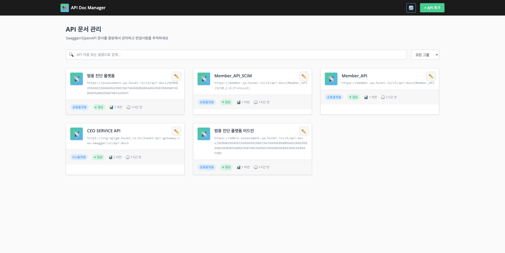
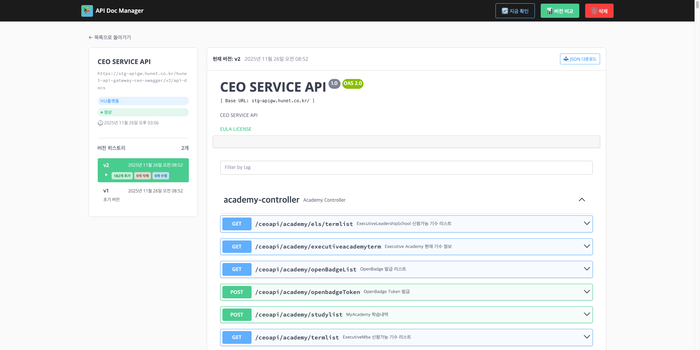

# API Doc Manager (ADM)

[](https://nodejs.org/)
[](https://www.mongodb.com/)
[](https://expressjs.com/)
[](LICENSE)

Swagger/OpenAPI 문서를 중앙에서 관리하고 버전별 변경사항을 자동으로 추적하는 시스템입니다.

## 스크린샷

### 메인 페이지 - API 목록


### API 상세 페이지 - Swagger UI 렌더링


## 주요 기능

- **Swagger 문서 URL 관리**: 여러 API 서비스의 Swagger URL을 등록하고 관리
- **자동 버전 관리**: Swagger JSON을 자동으로 다운로드하고 버전별로 저장
- **변경사항 자동 감지**: 이전 버전과 비교하여 추가/삭제/수정된 항목 자동 분석
- **심각도 분류**: 변경사항을 `low` / `medium` / `high` 수준으로 자동 분류
- **버전 비교**: 두 버전을 나란히 비교하고 변경된 부분 강조 표시
- **검색 및 필터링**: API 이름, 그룹별 필터링 지원

## 기술 스택

| 구분 | 기술 |
|------|------|
| Backend | Express.js 4.18.x |
| Database | MongoDB (Mongoose 8.x) |
| Runtime | Node.js 18.x |
| Frontend | HTML5 / CSS3 / Vanilla JavaScript |

## 빠른 시작

### 사전 요구사항

- Node.js 18.x 이상
- MongoDB 실행 중

### 설치 및 실행

```bash
# 저장소 클론
git clone <repository-url>
cd apidoc

# 의존성 설치
npm install

# 환경 변수 설정
cp .env.example .env
# .env 파일을 열어 MONGODB_URI 등 설정

# 개발 서버 실행
npm run dev

# 브라우저에서 접속
# http://localhost:3000
```

## 환경 변수

`.env` 파일에 다음 환경 변수를 설정합니다:

```env
NODE_ENV=development
PORT=3000
MONGODB_URI=mongodb://localhost:27017/api-doc-manager
LOG_LEVEL=dev
CORS_ORIGIN=http://localhost:3000
```

## 프로젝트 구조

```
apidoc/
├── server.js                 # Express 앱 진입점
├── package.json              # 프로젝트 메타데이터
├── .env                      # 환경 변수
│
├── src/                      # 소스 코드
│   ├── app.js                # Express 앱 설정
│   ├── config/
│   │   └── database.js       # MongoDB 연결 설정
│   ├── models/               # Mongoose 스키마
│   │   ├── ApiUrl.js         # API URL 등록 정보
│   │   ├── ApiVersion.js     # 버전 히스토리
│   │   └── AuditLog.js       # 감사 로그
│   ├── routes/               # API 라우트
│   │   ├── urlRoutes.js      # URL CRUD 엔드포인트
│   │   └── versionRoutes.js  # 버전 관리 엔드포인트
│   ├── services/             # 비즈니스 로직
│   │   ├── swaggerService.js # Swagger JSON 파싱 및 저장
│   │   └── diffService.js    # JSON 비교 및 변경사항 분석
│   └── middlewares/
│       └── errorHandler.js   # 전역 에러 처리
│
├── views/                    # HTML 페이지
│   ├── index.html            # 메인 페이지 (API 목록)
│   ├── api-detail.html       # API 상세 페이지
│   └── version-compare.html  # 버전 비교 페이지
│
├── public/                   # 정적 자산
│   ├── css/                  # 스타일시트
│   └── js/                   # 클라이언트 JavaScript
│
├── scripts/                  # 유틸리티 스크립트
│   └── seed-sample-version.js # 테스트 데이터 생성
│
└── examples/                 # 예제 Swagger JSON
    ├── swagger-v1.json
    ├── swagger-v2.json
    └── swagger-v3.json
```

## API 엔드포인트

### URL 관리

| Method | Endpoint | 설명 |
|--------|----------|------|
| `GET` | `/api/urls` | 모든 URL 목록 조회 |
| `POST` | `/api/urls` | 새 URL 등록 |
| `GET` | `/api/urls/:id` | 특정 URL 상세 조회 |
| `PUT` | `/api/urls/:id` | URL 정보 수정 |
| `DELETE` | `/api/urls/:id` | URL 삭제 |
| `PATCH` | `/api/urls/:id/activate` | 활성화/비활성화 토글 |
| `POST` | `/api/urls/:id/fetch` | Swagger JSON 수동 업데이트 |

### 버전 관리

| Method | Endpoint | 설명 |
|--------|----------|------|
| `GET` | `/api/urls/:id/versions` | 버전 목록 조회 |
| `GET` | `/api/urls/:id/versions/:versionId` | 버전 상세 조회 |
| `GET` | `/api/urls/:id/versions/:v1/compare/:v2` | 두 버전 비교 |
| `GET` | `/api/versions/latest/:count` | 최신 N개 버전 조회 |

### 헬스체크

| Method | Endpoint | 설명 |
|--------|----------|------|
| `GET` | `/api/health` | 서버 상태 확인 |

## 개발 스크립트

```bash
# 개발 서버 (자동 재시작)
npm run dev

# 프로덕션 서버
npm start

# ESLint 검사
npm run lint

# Prettier 포맷팅
npm run format

# 테스트 데이터 생성
node scripts/seed-sample-version.js
```

## 변경사항 심각도

| 심각도 | 기준 | 예시 |
|--------|------|------|
| **high** | 새 endpoint 추가, 필수 파라미터 변경 | path 추가, required=true 파라미터 |
| **medium** | 선택 파라미터 변경, RequestBody 수정 | optional 파라미터, schema 변경 |
| **low** | 설명 변경, 메타정보 수정 | description, summary 변경 |

## 의존성

### 프로덕션

| 패키지 | 용도 |
|--------|------|
| express | 웹 프레임워크 |
| mongoose | MongoDB ODM |
| axios | HTTP 클라이언트 |
| json-diff | JSON 비교 |
| cors | CORS 처리 |
| dotenv | 환경 변수 |
| morgan | HTTP 로깅 |
| joi | 입력 검증 |

### 개발

| 패키지 | 용도 |
|--------|------|
| nodemon | 자동 재시작 |
| eslint | 코드 검사 |
| prettier | 코드 포맷팅 |

## 라이선스

ISC License

## 작성자

Taejin Kim
